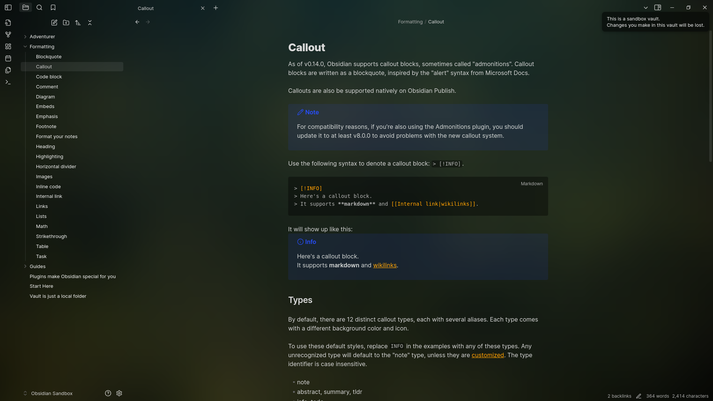
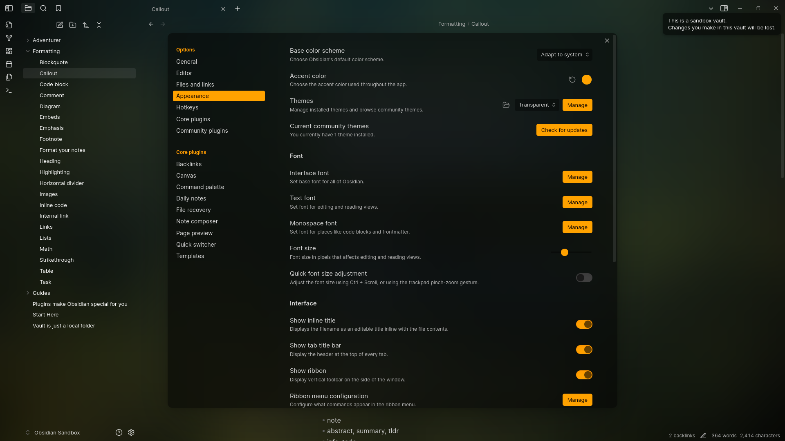

# Obsidian transparent

This theme is designed to be **light**, **simple**, **aesthetic**, and **minimalistic**. It provides a clean and unobtrusive user interface that allows you to focus on your notes without distraction, with **excellent mobile support**.

colors may differ a litte bit

settings looks like this (you dont have to change anything or so it is just preview), accent color from screnshoots; `#FFA200`

if you like this theme you can give a star to this repo on github

## Features

- **Light Color Palette**: The theme uses a soft color scheme that is easy on the eyes.
- **Minimalistic Design**: Clean lines and ample white space create a serene workspace.
- **Customizable Background**: You can add a background image by linking it in the `.css` file via base64, enhancing the visual appeal of your notes.
- **Integration with plugins**: Some plugins just look better with this theme due to taking them into account in the code.
- **Integration with snippets**: theme is made to work with my own snippets, for example [Accent everywhere](https://github.com/Oczko24/Obsidian_things/blob/main/css_snippets/Accent%20everywhere.css)

Enjoy a **beautiful** and functional writing experience with this theme!

i recommend to install this theme via obsidian theme browser because im regulary updating this theme:)

### Todo
---
- [ ] better light theme
- [ ] style plugin settings
- [ ] (maybye) plugin to change its background (its coded in base64, easy to change for advanced users)
- [ ] turn on/off my snippets from [Obsidian things](https://github.com/Oczko24/Obsidian_things) built in this theme via style settings

Built-in integration with plugins like:

- make.md
- MySnippets
- Day Planner

If you find any bug please let me know
