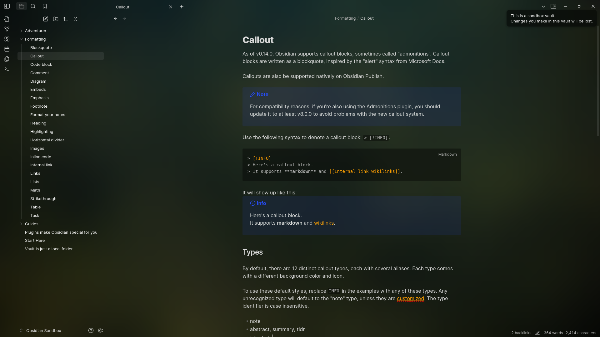

# Obsidian transparent

This theme is designed to be **light**, **simple**, **aesthetic**, and **minimalistic**. It provides a clean and unobtrusive user interface that allows you to focus on your notes without distraction.

if you like this theme you can give a star to this repo on github

## Features

- **Light Color Palette**: The theme uses a soft color scheme that is easy on the eyes.
- **Minimalistic Design**: Clean lines and ample white space create a serene workspace.
- **Customizable Background**: You can add a background image by linking it in the `.css` file via base64, enhancing the visual appeal of your notes.
- **Integration with plugins**: Some plugins just look better with this theme due to taking them into account in the code.
- **Integration with snippets**: theme is made to work with my own snippets, for example [Accent everywhere](https://github.com/Oczko24/Obsidian_things/blob/main/css_snippets/Accent%20everywhere.css)

Enjoy a **beautiful** and functional writing experience with this theme!

### Todo

- Full mobile support
- better light theme (i have code that is not full tested yet)
- style plugin settings
- (maybye) plugin to change its background (its coded in base64, easy to change for advanced users)

If you find any bug please let me know
