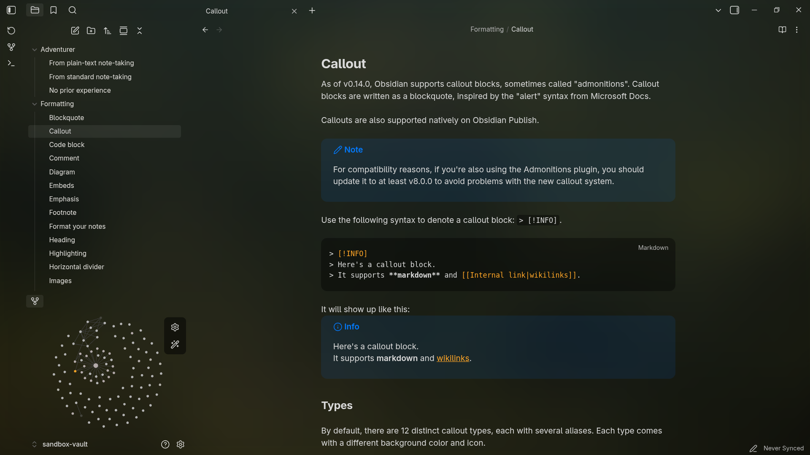
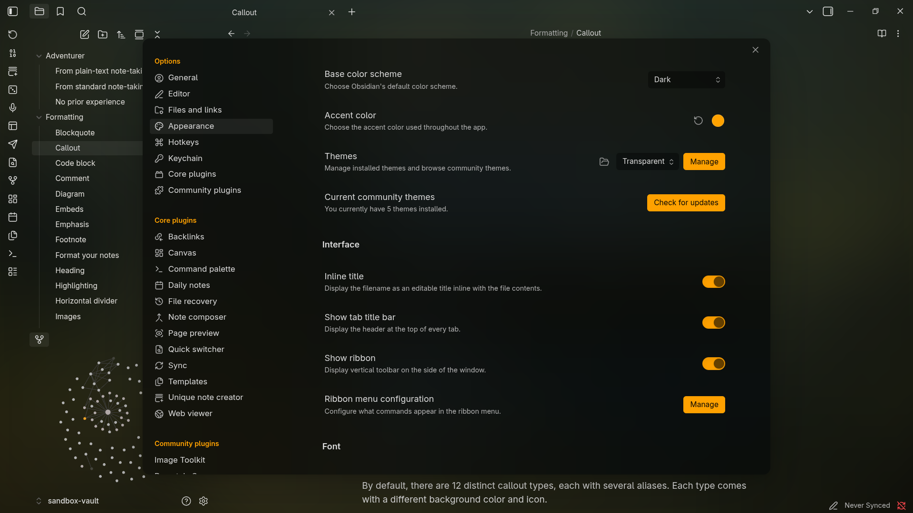
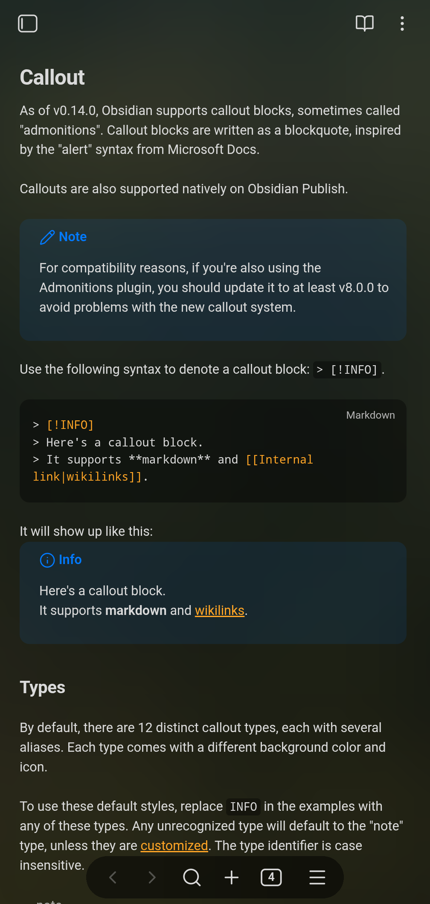
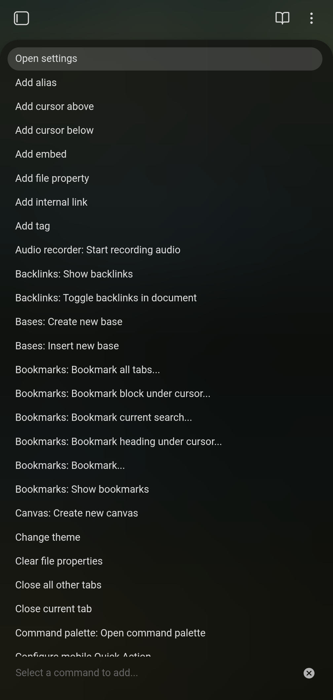
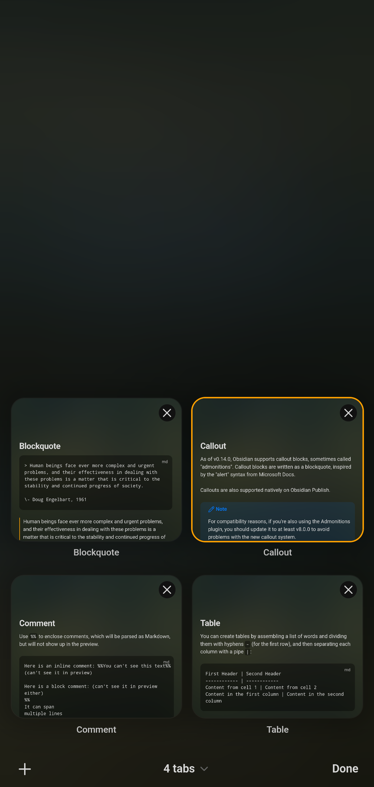
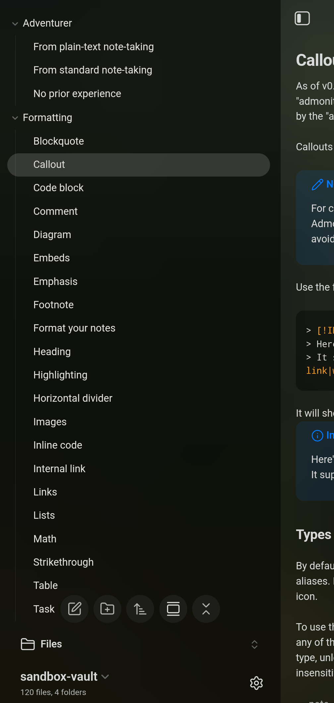

# Obsidian transparent

This theme is designed to be **light**, **simple**, **aesthetic**, and **minimalistic**. It provides a clean and unobtrusive user interface that allows you to focus on your notes without distraction, with **excellent mobile support**.

The theme is fully responsive and **supports both Light and Dark modes**, adapting perfectly to your system settings for a comfortable reading experience at any time.

  

> **Accent color from screenshots:** `#FFA200`

  

  
  
  
  

## Features

- **Light Color Palette**: The theme uses a soft color scheme that is easy on the eyes, perfect for long writing sessions.
- **Minimalistic Design**: Clean lines and ample white space create a serene workspace, **focusing on your content**.
- **Customizable Background**: You can add a background image by linking it in the `.css` file via base64 **or using CSS snippets**, enhancing the visual appeal of your notes. (for advanced users)
- **Integration with plugins**: Some plugins just look better with this theme due to **seamless integration**, taking them into account in the code.
- **Integration with snippets**: theme is made to work with my own snippets, for example; [Accent everywhere](https://github.com/Oczko24/Obsidian_things/blob/main/css_snippets/Accent%20everywhere.css)
- **Now you can change look of this theme via [style settings](https://github.com/mgmeyers/obsidian-style-settings)**

Enjoy a **beautiful** and functional writing experience with this theme!

i recommend to install this theme via obsidian theme browser because im regulary updating this theme:)

### Plugin Styling

Some plugins don't always look great by default - so this theme includes small tweaks to make them blend perfectly with the main design. **These plugins are styled to match the theme's transparency and blur effects.**

Works especially well with:

- Style Settings
- Make.md
- MySnippets
- Day Planner
- Remotely Save

You don't need to change anything – everything works out of the box.

### Roadmap

---

- [x] better light theme
- [x] style plugin settings
- [x] better mobile mode trough it is good rn especially after latest obsidian update (1.11.7)
- [ ] more readable readme + more screenshot especially from mobile
- [ ] more animations and make them all consistent
- [ ] unification of everything possible on every platforms
- [ ] the ability to change the background color to another via style settings etc.

---

### How to Install

1. In Obsidian, navigate to **Settings** -> **Appearance** -> **Themes**.
2. Click **Manage** and search for **Transparent** (by Oczko24).
3. Select **Install and Use**.

### Support

If you like this theme you can give a star to this repo on github :)

If you find any bugs or have ideas for new features, feel free to open an issue or submit a pull request. Your feedback and contributions mean a lot — they genuinely motivate me to keep improving and developing this project :))
